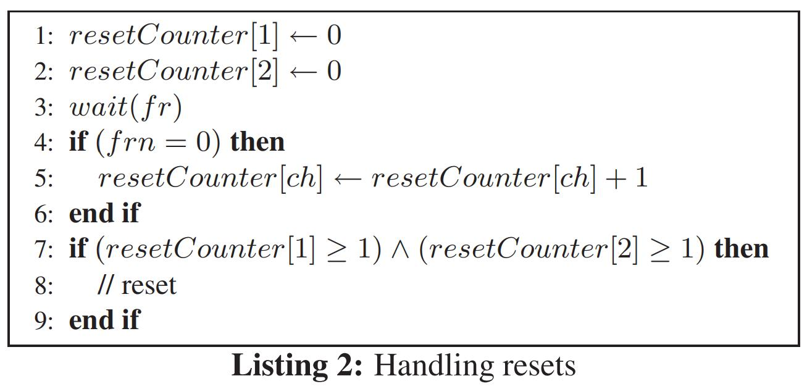

# Formal Modeling and Analysis of the AFDX Frame Management Design

> 译文仓库：https://github.com/LauZyHou/Papers2Chinese
> 库内编号：3

## 摘要

航空电子全双工交换以太网（AFDX）的开发旨在在飞机内部通信中提供可靠的数据交换，并具有强大的数据传输时间保证。 AFDX设计基于具有物理冗余链路的交换网络的原理，以支持可用性并容忍网络中的传输和链路故障。

在这项工作中，我们开发了AFDX帧管理的形式化模型，以确定设计的可靠性。 为了捕获精确的时间语义，我们将系统建模为时间自动机网络，并使用UPPAAL进行模型检查以检验用CTL表示的性质。 我们的分析表明，AFDX帧管理的设计容易受到诸如网络乱语(network babbling)之类的故障的影响，这些故障可能会触发不必要的系统重置。 我们展示了，可以通过修改原始设计以在接收端储帧的优先级队列来缓解这些问题。 我们还建议传达重置消息的冗余副本，以实现对网络乱语的容忍度。

# 1 介绍

一般的控制系统，尤其是航空电子系统，都依赖于从发送端到接收端的完整、及时的消息递送。对于安全攸关的系统，可靠的实时通信链接至关重要。航空电子全双工交换以太网（AFDX）[3]已经开发出来，可以满足商用飞机应用的这些要求。 AFDX是IEEE802.3标准以太网[9]的标准版本的子集，具有关键的增强功能，可提供确定的定时和可靠的消息传递。确定性定时(Deterministic Timing)是通过具有有限带宽(bounded bandwidth)和帧传递间隔的虚拟链路(VL)上的通信来实现的。通过冗余通道进行通信可实现消息的可靠传递。帧管理机制负责在将消息传递到应用程序之前检查消息帧的完整性并管理冗余。因此，帧管理是AFDX设计的重要组成部分，必须从设计层面进行保证。

在这项工作中，我们开发了AFDX帧管理的形式化模型，分析并验证了在不同类型的网络故障下是否满足需求规范。在开发帧管理的形式化模型时，我们使用时间自动机[1]，它可以定量捕获时间信息。我们的特定模型由时间自动机网络组成，该网络具有一个发送端系统，两个通信通道和一个接收端系统。该系统用UPPAAL[5]进行描述，支持用CTL书写的模型检测性质。从我们的分析中发现，该设计很容易出现故障，例如网络乱语，如果它们乱序出现，则会导致不必要的重置和丢帧。为了充分利用消息中的冗余并使用此冗余来检测故障，我们建议在接收方设置一个优先级队列。这将有助于检测通道上的网络乱语，即使帧顺序混乱也可以按顺序将帧发送给应用程序。为了降低错误重置的可能性，我们建议传送重置消息的冗余副本。这些修改可以轻松地合并到原始设计中，并为AFDX帧管理提供更高的可靠性。

本文的主要内容如下：第3节介绍AFDX和帧管理，第4节介绍系统的时间自动机模型，第5节介绍分析和结果。 最后，我们在第6节中提出修改，并在第7节中得出结论。

# 2 之前的工作

ARINC-664[2]是航空电子通信体系结构的商业标准。 AFDX[3]是该标准的供应商特定实现。它基于802.3标准以太网，并进行了增强以确保确定性和可靠性。在[10]中确定了交换式以太网航空电子网络的概述以及测试挑战。尽管他们的工作集中于通过仿真对各种模块进行硬件测试，但我们的重点是在不同故障下对设计进行形式化建模和分析。我们的模型是使用UPPAAL开发的，UPPAAL是一种免费工具，可以使用时间自动机的各种功能进行建模，称为时间安全自动机[7]。 UPPAAL中的建模语言建立在时间自动机模型的基础上，提供了有用的扩展，例如整数变量，广播通道，紧急位置和已提交位置等。UPPAAL中的模型检查器允许使用简化版本的CTL指定查询，该查询语言由CTL组成路径和状态公式，但是路径公式不能嵌套。关于UPPAAL中协议的建模和验证，已有大量文献提供(c.f.，[6，8，12])。

# 3 AFDX和帧管理

AFDX网络的主要元素是端系统，交换机和链路。端系统(ES)的功能是提供服务，以确保与分区软件进行安全可靠的数据交换。每个端系统都直接与交换机建立双向连接。可能会有多个这样的连接用于冗余通信。交换网络可确保将数据从一个端系统移动到另一端系统所需的连接和带宽可用。服务质量(QoS)提供了一种对流量进行分类的方法，并确保特定种类的流量将始终在其有权获得的服务级别上流经网络，而与竞争需求无关。对于飞机网络，无论数据类型如何，都必须满足每个网络传输请求，并且必须保证最大的网络传输延迟(称为端到端延迟(L))。有保证的服务可提供可靠的，数学上可证明的端到端延迟的上限。

虚拟链路(VL)是以太网协议的基础。 每个VL定义了从一个源端系统到潜在的多个目标端系统的单向链接，通过该链接可以交换数据帧。 链路上的数据流由端系统根据带宽分配间隔(BAG)控制。 BAG值是端系统分配的时间片，并由端系统为VL传输数据。 这些时间以毫秒为单位，通常为2的幂。

通过利用冗余链接，可以确保AFDX设计中可靠的帧传送。 网络冗余的基本概念如图1所示。端系统通过多个通信通道进行通信，从而可以保护通信以防丢失一个完整的网络。

冗余方案按以下方式在每个链路上运行：发送端系统准备一些数据并将其传递给通信协议栈。 在此，将序列号添加到每个帧，以使接收功能能够在传输到接收分区之前重建帧的单个有序流而无需重复。 序列号是一个字节长，范围从0到255，并且在每个连续帧中递增。 255之后，序列号将折回到1。序列号0保留用于传递复位。 这样，分区就不会意识到底层的网络冗余，并且可以在通信栈和利用网络服务的分区之间建立一个简单的接口。

在默认模式下，每个帧都通过两个网络发送，并且冗余在接收端系统中进行。 为了简化接收端系统的算法，应在0.5ms的最大时间差内发送帧的冗余副本。 接收时，通信栈(IP层以下)中的算法使用“首次有效获胜”("First Valid Wins")策略。 这意味着将接受来自任一网络的具有下一个有效序列号的第一个帧，并将其沿堆栈向上传递到接收分区。 当接收到具有该序列号的第二帧时，将其简单地丢弃。 如下面的图2中所示的帧流所示，在完整性检查(IC)之后设置了冗余管理(RM)。

在无故障的网络操作下，IC会针对每个网络独立地将其接收到的帧传递到RM。 如果存在故障(基于序列号)，则IC的任务是消除无效帧，并相应地通知网络管理。 对于每个网络，IC都会在以下间隔中测试每个帧的序列号：$[PSN \oplus 1, PSN \oplus 2]$，其中前一序列号(PSN)是在此VL上接收到(但不一定转发)的前一帧的序列号。 运算符$\oplus$将序列号的折回考虑在内。 因此，例如，如果$PSN=254$，则$PSN \oplus 1=255$且$PSN \oplus 2=1$。

AFDX冗余管理的功能仅仅是消除作为已传递到分区的帧的冗余副本的帧。RM假定网络运行正常，尤其是已验证确定性。 RM配置通常基于SkewMax参数：即两个冗余帧的接收之间的最长时间。 该值取决于网络拓扑(帧交叉的交换机数量)，并且应由系统集成商提供。 SkewMax值(以ms表示)在配置VL给出。

# 4 系统模型

我们对AFDX帧管理建模，在上一节中介绍了时间自动机网络。 时间自动机模型使我们能够定量捕获时间方面的帧管理，例如最大延迟，skew和BAG。 该模型是使用UPPAAL开发的。在我们的模型中，我们具有三个角色：发送端系统，通道和接收端系统。 我们将限制两个冗余通道的使用。 但是，扩展更多冗余通道的理由非常直接。

## 4.1 发送端系统

发送端系统在冗余通道上发送消息。 假设消息(msg)被分解为帧(fr)，然后经过通道进行通信。 发送端系统的模型如图3所示。初始状态为$Init$，在该状态中，消息在彼此之间差距0.5ms以内的两个通道上发送。 由于UPPAAL只允许对时钟变量进行整数约束，因此在模型中，我们使用$c<1$来捕获此约束。

消息的实际发送是通过通道$msg\_one$和$msg\_two$捕获的。 传输之后，系统将一直等到BAG结束以转换回初始状态。 从初始状态，系统可以不确定地进入$Reset$状态，该状态捕获了发送端系统的重置。 如果存在复位，则在两个通道上发送指示复位的帧0之前，我们要等待时间$HR$。 这反映了传输系统经过硬件重置所花费的时间。 在模型中，每当系统重置时，都会设置布尔变量$rchk$。 这将帮助我们追踪复位的执行，并确定接收系统是否响应发送器的复位而复位。

## 4.2 网络通道

网络通道负责从发送端系统传输帧并将其传递到接收端系统。 我们这里的工作重点是为各种类型的网络故障建模，并查看其对帧管理的影响。 在此模型中，我们考虑两种网络故障：

1. 与传输相关：在此类别下，我们考虑诸如误码，丢包等错误。我们将这些错误建模为不确定的和独立的。 然而，实际上，通常假设连续帧中的错误概率接近于零。 尽管如此，假设错误是独立的，可以使模型简单，同时在实践中保留其可能的影响。

2. 网络乱语：网络有时可能会乱语，即，将任意帧传递给接收方，我们在网络通道中对此故障进行建模。 再次，我们假设网络乱语是不确定的，并且与其他故障无关。

最初，系统处于$Idle$(空闲)状态。 收到消息$msgr$(可以是$msg\_one$或$msg\_two$)后，它将转换为$Transmitting$(发送)状态。 如果传输成功，则达到$SendSuccessful$状态。 系统可以在此状态下保持$max\_latency$的时间，然后通过$Update$状态将帧传递到接收端系统。 帧的传递由$msgd$发出信号。 如果传输失败，则进入$SendFailed$状态，系统从该状态返回到初始状态。 在状态$Babble$和$BabbleSend$中建模网络乱语，通过将随机编号的帧($rv1$)传送到接收端系统。

我们还在$frq$中实现了一个消息帧队列。 在模型中，我们考虑此队列的最大长度为5。 这样可以使网络和传输器相互独立。 每当发送端系统发送时，帧就排队，然后由网络发送。

引入了一个可变的$chk$来跟踪所传送的帧。 如果正在传递有效帧，则将它赋值为1，否则将其赋值为0。如果正在传递帧是由于网络乱语，则将$chk$赋值为3。

## 4.3 接收端系统

接收端系统实现完整性检查(IC)和冗余管理(RM)。 IC会丢弃不在$[PSN \oplus 1，PSN \oplus 2]$区间内的帧，除非帧号为0。由于“第一个有效获胜”策略，在RM中也可能会丢弃这些帧。 这两个策略都在我们的模型中实现。

如图5所示，用于接收终端系统的自动机最初处于$NotRecd$状态。 如果从第一个通道接收到有效的数据包，则它将通过状态$RecdOne$更新前一个序列号($psn$)。 有效的帧也通过$stateRecdTwo$处理。 这两个状态均已标记为已提交。 因此，在此状态下不允许时间流逝，并立即转换回$NotRecd$。 $psnlb$和$psnub$用于跟踪间隔范围。 接收到一个0后，系统将通过状态$Reset$进行重置。

我们结合了几个变量来检查某些感兴趣的情况，例如是否接受乱语帧，重置等：

1. $chk$：此变量与网络通道共享，当它被RM丢弃但通过IC时，赋值2。

2. $resetchk$：这是一个布尔变量，每当接收系统重置时设置。

3. $babchk$：一个布尔变量，每当接受一个乱语帧时设置。 请注意，乱语帧是通过检查是否$chk=3$成立来判断的。

4. $valid$：此变量也是一个布尔值，只要状态$RecdOne$或$RecdTwo$之一接受该帧，就会设置此布尔值。

# 5 分析和结果

帧管理的语义取决于各种参数之间的关系，例如，实际等待时间(actual latency)，冗余帧接收之间的偏差(skew)以及硬件重置的时间。 在这里，我们考虑两种不同的情况：

令$L_{max}$为帧到达的最大等待时间，$L_{min}$为最小等待时间，而$SkewMax$为传递冗余帧之间的时间。 考虑如图6所示的帧到达的情况。让我们假设一个帧是在时间$t$在第一个信道上传递的。 另一个信道上的冗余帧可以迟到$t + SkewMax$到达，而第一个信道上的后续帧可能最早在下一个$BAG$中的$L_{min}$到达。 因此，如果$BAG - t + L_{min} > SkewMax$，则冗余帧将在第一个通道上的相继的帧之前到达。 由于在最坏的情况下$t$可以和$L_{max}$一样大，要要求冗余帧在连续帧之前到达，我们应该使$BAG - Lmax + Lmin> SkewMax$。 现在，我们基于此条件分析模型。

【1】 情况$SkewMax <(L_{max} + BAG - L_{min})$：这种情况可能适用于许多类型的消息，例如具有实时数据的消息。 在这种情况下，尽管帧按顺序到达，但我们还是要测试传输故障，网络乱语和重置消息下的行为。

(a) 永远不会接受乱语帧：变量$babchk$用于验证此属性。 所需属性由CTL条件$E<>(rs1.babchk \ \ \&\& \ \ rs1.valid)$表示。 该属性已在模型中被满足，并生成了以下trace：如果一个网络乱语的帧号位于$[PSN \oplus 1，PSN \oplus 2]$之间，则此消息将被接受，来自另一个网络的合法帧将被拒绝，即使它成功递送。

(b) 接收端系统重置意味着发送系统重置：这是使用条件$A[] \ \ rs1.Reset \ imply \ rchk$表示的。 在这种情况下，将生成以下反示例：如果网络乱语出一个重置帧，则会导致接收端系统错误地进行重置。

【2】 情况$SkewMax \geq (L_{max}+BAG-L_{min})$：对于这种类型的消息，例如具有多媒体内容的消息，$skew$实际上可能比$Lmin + BAG-Lmax$长。 在这种情况下，冗余帧可能会在第一个通道上的后继帧到达之后才到达。 因此，除了确保不接受乱语的帧并且没有错误的重置之外，我们还测试了帧在交付给接收器时是否曾经丢失过。

经过模型检查后，针对这三种情况都生成了一个反例。 我们提供了在测试最后一个属性时生成的反例。 前两种情况的反例与上面给出的类似。

- 如果传递了有效且非冗余的帧，则不会将其丢弃。此属性是使用CTL条件$A[] \ \ chk!=2$表示的。 当两个网络中的较快的网络成功传送无效帧和有效帧，在较慢的网络可以传送第一个帧之前，接收端系统会从较快的网络中接收第二个帧，并将有效的第一帧视为无效帧并将其丢弃。
我们注意到，尽管AFDX设计文档[3]中提到了这种情况，但仍未解决。 丢帧可能会影响$QoS$，因此应避免。 在下一节中，我们将说明对原始设计进行较小的改动可以帮助避免此问题，从而确保良好的$QoS$。

# 6 改善帧管理的设计

可以将帧管理设计修改为能够处理网络乱语，也不要忽略迟到的有效帧。 我们建议对设计进行两项更改，以帮助我们实现这些目标。

## 6.1 将IC和RM与优先级队列集成

改善帧管理的第一个建议是引入带有排队模块的完整性检查，而不是原始设计中区分的IC和RM模块。 修改后的设计如图7所示。list 1描述了将帧号为$frn$的帧$fr$交付给模块时所采取的行为。 主要思想是，每当一个帧被传送以使其对那个特定通道有效时，它就会进入队列。 如果该特定帧已存在于队列中，则将对其进行验证以确保一致性。 如果某个通道两次发送相同帧号的帧，则将其视为网络乱语并且忽略该帧。 由于先前从同一通道传递的帧也可能会成为网络乱语的原因，因此我们应将其从队列中删除，以避免接受不合法的帧。

在list 1中，我们假设$enqueue$和$isPresent$是已实现的函数。 假定$enqueue$将消息和帧号作为输入，并根据优先级将其排队在队列中。 假定$isPresent$检查队列中是否已存在特定帧，如果存在则返回该帧，否则返回$null$。 复位的情况，即$frn=0$，将在下一部分中讨论。 我们还假设我们有两个计数器$psn[ch],ch=1,2$，用于跟踪该通道的先前序列号。

使帧出队：队列中的消息可以立即出队并移交给应用程序。 每当我们将一个元素入队时，可以在从另一个通道接收到冗余帧时或在时间$SkewMax$之后给它加上时间戳并使其出队。 如果冗余帧未能到达，那么，我们将不得不等待连续的帧到达信道，以便可以对其进行乱语测试(等待$Lmax + BAG - Lmin$)。 为了避免干扰优先级，在接收到帧255且不干扰优先级之后，也要清空队列，帧编号再从1开始。

与修改后的设计相比，在额外的等待时间可能高达$L_{max} + BAG - L_{min}$的情况下，原始设计在最坏的情况下会在第一个通道上丢帧时引入$SkewMax$的延迟。 但是，尽管有更高的延迟，但改进的设计可能会更适合实施，因为它可以提供更好的数据完整性和$QoS$。

## 6.2 处理重置

AFDX帧管理的问题之一是，它容易受到乱语导致的重置的攻击。 只要帧号大于0，IC就会工作，但是接受帧0会复位。 问题在于，只有两个通道和一个重置消息，我们不能同时兼顾网络乱语和传输损失：如果在终端系统上仅接收到一个重置消息，则可能是由于一个信道上的网络乱语或 传输损耗。

实现容忍乱语的一种策略是增加冗余通道的数量。 这样，表决体系[4]可用于决定重置与否。 为了实现对一个通道的乱语的容忍，我们至少需要三个通道。 但是，包括更多的冗余通道会增加大量开销，因此对于实施而言不是有吸引力的选择。

具有更多冗余通道的一种替代方法是在每个通道上发送冗余消息。 这个想法是，我们不发送一次帧0，而是在两个通道上发送两个重置消息(帧0)。 接收器仅在从任何一个通道获得至少一个0帧时才复位。 list 2中对此进行了描述。可以很容易地看出，该设计可以容忍在一个信道上乱语，并且由于传输而丢失消息。 与添加额外的通道相比，此处的缺点是接收机重置之前的延迟增加。 但是，由于没有额外的开销，因此与添加额外的信道相比，此方案可能更可取。

修改后的设计分析：我们根据上述建议修改了时间自动机模型，并检查了所需的属性。 当删除一个通道上的两个帧时，只有重置性质$A[] \ \ rs1.Reset \ \ imply \ \ rchk$生成一个反示例。 尽管这是可能的，但实际上发生这种情况的可能性非常小。

## 6.3 设计权衡

我们注意到，在接收器的延迟与添加额外的通道之间需要权衡：通过增加独立通道的数量，我们可以减少延迟，并通过减少通道的数量，我们将必须传输多个副本，这导致延迟增加。 因此，确切的设计选择将取决于手头的应用。 如果可以接受额外的延迟，那么我们可以不使用额外的通道。 但是，许多关键的应用都需要使用额外的通道来实现容错能力。

# 7 总结和未来工作

AFDX是航空电子通信架构商业标准的实现，称为ARINC-664。它被开发用于在航空电子应用的交换式以太网中提供可靠而确定的帧传输。为了提供这些保证，将通过具有有限延迟和带宽的冗余链路发送帧。帧管理负责管理冗余并在将帧交付给应用程序之前检查帧的完整性。帧管理还旨在实现对诸如传输错误和网络欺骗之类的故障的容忍度。在这项工作中，我们使用时间自动机网络开发了AFDX帧管理的形式化模型。从我们的分析中，我们发现设计容易受到乱语导致的复位和掉帧的影响。为了解决这些问题，我们建议在优先级队列的帮助下集成冗余管理和完整性检查，并在每个通道上复制重置消息。这些修改相对容易地结合到原始设计中，并有助于实现对信道干扰的容忍度和更好的$QoS$。

## 7.1 测试AFDX实施

在以后的工作中，我们建议根据我们已经开发的UPPAAL模型生成测试套件。 测试AFDX实现将涉及按照自动机模型在网络中注入故障，并观察在接收端系统处注册的更改。 然后必须控制注入网络的故障，并观察行为的可能性，以发现不同的错误，包括同一错误的多个实例以及不同类型错误的同时发生。 已经开发了基于UPPAAL模型的在线测试[11]，我们希望对其进行调整以为我们的模型生成测试。

