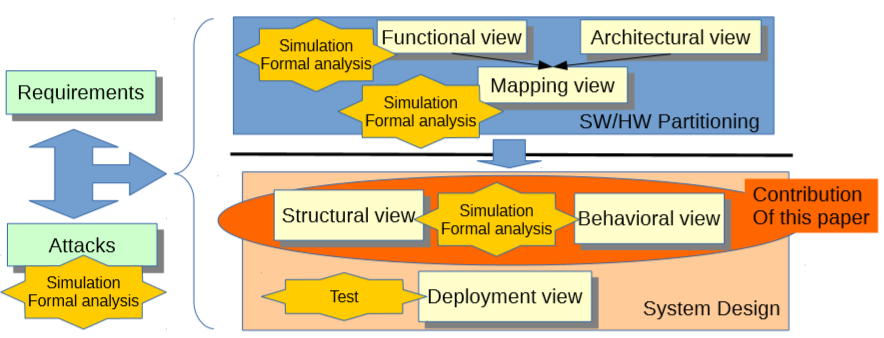
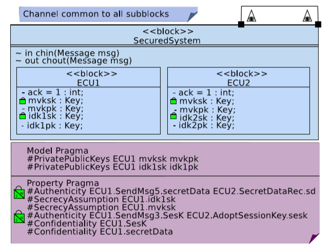
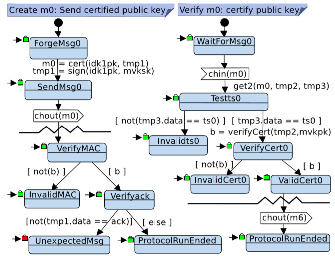
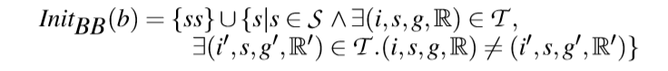
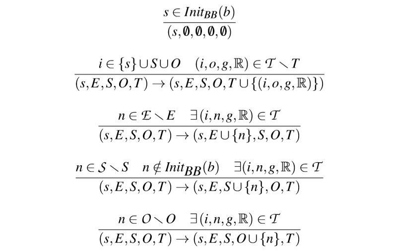
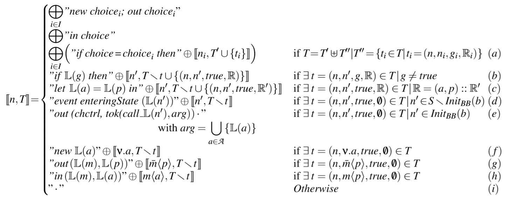
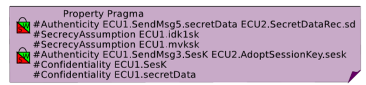

# SysML Models and Model Transformation for Security

> 译文仓库：https://github.com/LauZyHou/Papers2Chinese
> 库内编号：1

## 关于原文和本文

论文原文：[下载](https://perso.telecom-paristech.fr/apvrille/docs/Modelswards2016_Lugou_paper.pdf)

避免迷惑，Safety和Security作为表特定含义的词，在本文的某些地方出现时原样保留。

## 关键词

SysML-Sec, Security, Model-driven engineering, Model transformation, ProVerif, TTool

## 摘要

嵌入式系统的安全漏洞已经成为网络犯罪分子的有价值目标。引入SysML-Sec是为了在这些系统的开发过程中来保证其安全性。然而，在这些阶段评估对攻击的抵抗能力需要有效地捕获系统的行为，并从这些行为中对安全性属性进行形式化证明。因此，本文提出(i)新的SysML模块和状态机图，以更好地捕获Security特征，(ii)模型到ProVerif的转换。ProVerif是第一个发布用于安全协议的形式化分析的工具包，但它可以更广泛地用于评估保密性(Confidentially)和真实性(Authenticity)属性。本文用一个复杂的非对称密钥分发协议证明了该方法的有效性。

# 1 介绍

连接嵌入式系统和物联网系统的比例越来越高，为网络犯罪分子提供了更多的攻击机会。仅举几个过去攻击此类连接系统的例子，我们可以谈及ADSL路由器(Assolini, 2012)、移动电话&智能手机(Maslennikov, 2010)、航空电子或汽车系统(Hoppe等，2011)和智能对象，例如Fitbit最近暴露的漏洞(Apvrille, 2015)。医疗器械的安全漏洞甚至已经被披露，例如Hospira Symbiq加药泵(ICS-CERT, 2015)。这种攻击还针对工业系统，这些系统的传感器越来越多地与易受攻击的信息系统相连接，Stuxnet、Flame和Duqu (Maynor, 2006)攻击就证明了这一点。这些系统的可靠性有不同的目标，例如恐怖分子和勒索软件。

> 译者注："加药泵"(drug pump)，或叫"给药泵"、"注药泵"是一种医疗器械。

在代码大小、分布以及异构等其他方面引起的系统复杂性是一个主要的风险因素。要更好地考虑这些系统的风险，一个解决方案是在开发周期中考虑它们的所有约束，包括安全性。我们之前介绍了SysML-Sec环境来处理此类复杂系统的设计，包括Safety、性能和Security(Apvrille和Roudier, 2015)。SysML-Sec从需求和可能的攻击着手处理系统开发，顾及软件/硬件的划分。在划分阶段之后，SysML-Sec还支持软件组件的设计，同样考虑到了Safety和Security。TTool是支撑SysML-Sec的一款免费且开源的工具(Apvrille, 2003)。

> 译者注：heterogeneity多相性，这里据语境翻译成了异构性。

TTool依赖于UPPAAL进行Safety的证明，并依赖于ProVerif从SysML-Sec框图执行Security的证明。然而SysML-Sec有些很严重的限制，在建模方面(即对Security特征建模)以及在证明方面(模型到proverif的转换中的限制)。本文使用新的建模和转换方法解决了其中的一些限制。特别是，我们已经完全形式化并实现了模型转换。

下一节给出了有关Security的建模和验证环境方面的相关工作。第三节介绍了SysML-Sec。第4节关注建模扩展以及模型到proverif的转换。第5节介绍了TTool的更新版本和验证特性。最后，第六部分对全文进行了总结。

# 2 相关工作

在设计软件组件时，评估Security属性主要依赖于形式化方法。例如，(Toussaint, 1993)提出用概率分析方法验证加密协议。协议被表示为树，树的节点捕获知识，边被分配转移概率。尽管这些树可能包含恶意代理，以便对攻击和威胁进行建模，但仍然没有显式地表示Security属性。此外，对于威胁分析，攻击应该明确表示，并手动解决。(Trcek和Blazic, 1995)为实现Security目标定义了一组形式上的的基本Security服务。在这种方法中，对Security属性的分析强烈依赖于设计者的经验。此外，威胁评估并不容易实现。

在更多最近的研究中，时态逻辑语言被用于表示安全属性。(Drouineaud et al., 2004)将一阶线性时态逻辑(LTL)引入到Isabelle/HOL定理证明程序中，从而使对系统及其Security属性建模成为可能，但不幸的是，这会产生不易复用的特定模型。(Mana and Pujol, 2008) 混合了形式化的以及非形式化的Security属性，但整个验证过程并非完全自动化，需要专门的技能。类似地，软件架构建模(SAM)框架(Ali et al., 2009)旨在填补非形式化的Security需求与其形式化表示和验证之间的鸿沟。SAM使用形式化和非形式化的Security技术来完成目标的定义和缺陷的缓解。因此，依赖于符号模型验证器(SMV)，可以在LTL模型上验证liveness和deadlock-freedom properties。即使SAM依赖于一个成熟的工具包(SMV)，然后处理一个威胁模型，"从Security属性到证明"的过程也不是自动的。

> 译者注：这里deadlock-freedom可以翻译为无死锁性。

UMLsec (Jurjens, 2007)是一个建模框架，旨在定义软件组件及其组成在UML框架中的Security属性。它还提供了一个相当完整的框架，用于处理模型驱动的安全软件工程的各个阶段，从Security需求的规格说明书到测试，包括关于软件组件的组成的基于逻辑的形式化验证。

最近，(Shen et al, 2014)开发了一个扩展的UML模型，该模型扩展了用于安全协议验证的UML序列图。他们的方法还包括将模型转换为验证机密性和通信的ProVerif。然而，我们的工作包括状态图，以用于为更广泛的协议建模。基本序列图可以只对单个执行过程进行建模，而状态图可以对包含if语句和循环的协议进行建模。此外，我们的过程包括验证弱和强的真实性(authenticity)。

关于我们以前发表的内容，我们提出了一种更好的模型状况(例如循环)及其模型到ProVerif转换的方法，考虑到了ProVerif的功能和限制。因此，我们设法限制Security属性证明失败的那些case，而不影响SysML-Sec图的Safety证明的功能。

# 3 上下文（研究背景）

## 3.1 SysML-Sec

> 译者注：本节"安全"均指原文是"Security"。

SysML-Sec连接面向目标的的安全需求和攻击的描述(图1的左部)，以及基于软件/硬件划分的资源的细粒度表示(图1的右上部分)。SysML-Sec还支持在划分阶段结束后实施V-cycle(图1的右下方)，特别是软件功能划分的设计。设计阶段包括安全机制的定义，以及对在设计中需要证明的安全属性中对安全需求的细化：本文讨论了这一阶段。验证在不同的工程阶段进行。为了评估安全机制在性能方面的影响，通常在划分阶段进行模拟。形式化验证旨在证明系统的设计对威胁的弹性(抗逆力)。测试也有类似的目的，但是是基于设计模型的部署实施(Apvrille和Roudier, 2015)。

SysML-Sec设计由SysML块和状态机图组成。SysML-Sec块可以定义一组对应于加密算法的方法，例如encrypt()，以便能够描述基于这些算法构建的安全机制，例如加密协议。块还可以预设共享值，这是设置加密协议通常需要的特性。

> 译者注：这里预设共享值，比如就是双方直接用对称加密的方式通信时，可以预先给双方设置相同的密钥，即假设已经解决了密钥分配的问题。

SysML-Sec设计的形式化证明依赖于UPPAAL (Bengtsson and Yi., 2014)和ProVerif(Blanchet, 2009)，分别用于证明Safety和Security属性。ProVerif是一个工具包，它依赖于Horn子句解析，在Dolev-Yao模型下，通过加密协议自动分析Security属性。ProVerif接受的输入是一组Horn子句，或者pi演算中的带有一组查询的一个规范。接下来ProVerif输出是否每个查询都是满足的。在后一种情况下（指接受pi演算），ProVerif尝试标识一个踪迹，以解释不满足查询的结论是如何得出的。

> 译者注：Horn子句解析(Horn clauses resolution)，pi演算(pi-calculus)。

Safety证明考虑了除专门为Security目的定义的设计元素之外的所有设计元素：面向Security的实用程序和对Safety属性(liveness、reachability)没有影响的加密方法。类似地，Security属性的证明将抽象出不相关或不受支持的系统细节。例如，Security证明不需要时间信息，因此不考虑时间操作符(after子句)。其他建模元素，如循环，在转换过程中被忽略。

> 译者注：活性(liveness)，可达性(reachability)。

图1：总览SysML方法论。

## 3.2 SysML-Sec设计图中缺少的功能

自从我们第一次提出将SysML-Sec模型转换为ProVerif以来，我们从有献身精神的测试者们那里收集了有价值的反馈。在容易纠正的边缘case或可用性bug中，一些鲁棒性的问题显示出了更为基本的问题。这些问题常常与SysML-Sec中的功能特性的语义与ProVerif中的功能特性的语义不匹配有关。我们提出了一些最重要的问题，促使我们完全重新设计翻译过程:

**循环。** 通常，用户利用TTool中嵌入的验证功能来评估提供服务的系统的安全性。对于某些系统，使用循环对它们的状态机建模似乎很自然。不幸的是，ProVerif第一步试图将给定的规范摊平。在实现时使用直接向前的转换，这使得对包含循环的设计的验证将无法终止。我们在本文中解决了这个重要的缺陷。

**私有的通道。** 与ProVerif一样，SysML-Sec允许用户对两种类型的通道建模：私有通道和公共通道。虽然它们应当和在ProVerif中的的语义相同，但是它们在可达性(reachability)查询方面的行为不同。ProVerif假定发送的消息总是被接收。在私有通道上，只有那些明确指定的某些才能读取发送的消息，而在公共通道上，攻击者也可以读取消息。在评估事件的可达性时，ProVerif尝试重新构建一个跟踪，并在触发事件的准确时刻停止。因此，如果事件发生在刚刚将消息发送到私有通道上以后，这时消息还不会被读取。因此ProVerif认定这个跟踪是无效的，返回的是一个不能被用于证明的结果。正如我们希望的，在我们的研究背景之下，能提供证明可达性的能力，修改私有通道的表示也是在我们工作中处理的一个重要问题。

# 4 扩展图

## 4.1 深入设计图

在TTool中，用户首先构建框图和相关的状态图作为图形模型。框图描述了系统的体系结构和组成，与框图关联的状态图描述了它们的行为。

我们给出了一个来自欧洲FP7 EVITA项目的例子，它定义了汽车通信系统的安全架构(Kelling et al.， 2009)。在这个架构中，对安全起关键作用的ECU(电子控制单元)与CAN或Flexray总线互连。汽车系统可能因为经济原因(免费激活可选功能)或犯罪目的而受到攻击。汽车系统与信息系统(路标、通行费等)和互联网的互联互通为攻击这些系统提供了新的途径。

为了避免攻击及其在ECU上的传播，会话密钥定期分布在相关ECU组中。图2展示了一个包含实体ECU1和ECU2的非对称密钥分发协议的框图。图3显示了它们描述通信协议的状态图的大致情况。ECU1处理密钥并将其发送到公共通道，ECU2接收消息，验证密钥并使用它发送消息。锁显示验证结果，这在第5节中再详说。

> 译者注：会话密钥session key。

图2: 非对称密钥协议框图

 

图3: ECU1和ECU2的状态图

将图形化模型转换成ProVerif、UPPAAL等语言进行验证。第4.1.2节提供了详细的形式化描述。

### 4.1.1 用pragma扩展SysML-Sec

并不是所有的模型参数和查询都在框图和状态图中以图形形式表示。例如，我们需要在会话开始时声明两个属性相等的功能。我们使用pragma扩展了SysML，即关于系统属性的正式文本注释。pragma分为模型pragma和属性pragma。模型pragma为块的属性提供了更多面向Security的语义，而属性pragma描述块的属性或状态机的Security属性。表1展示了若干pragma。

|        模型pragma       |                   描述                   |
|:-----------------------:|:----------------------------------------:|
|    PrivatePublicKeys    |        块的两个属性分别设置为私钥和公钥       |
| InitialSessionKnowledge |       列出的属性在会话开始时具有相同的值      |
|  InitialSystemKnowledge |       列出的属性在系统启动时具有相同的值      |
|    SecrecyAssumption    | 假设列出的属性具有保密性。ProVerif随后验证了它们 |
|         Constant        |          将字符串声明为可能的常数值          |

|       属性pragma       |             描述             |
|:----------------------:|:----------------------------:|
| Confidentiality/Secret |      查询列出的属性的保密性     |
|      Authenticity      | 查询给定状态下的弱真实性和强真实性 |

表1: Pragma的描述

### 4.1.2 SysML-Sec图的形式化

为了给ProVerif在SysML-Sec设计图上执行的证明提供可靠的数学基础，我们决定按照TTool中描述的方式，形式化地表示对模型执行的转换。这种形式化表示将有助于理解我们如何将一个通用的SysML图链接到一个依赖于Horn子句的ProVerif规范，以及不完整性的来自哪里。这种形式化表示也是为将来的工作建立等价性的数学证明的第一步。

第一个转换将与时间相关的功能转换为一组块和信号。在我们的形式化过程中，自然要考虑到后者。

形式上，让我们用$\mathcal{D}$表示SysML-Sec图的集合；$d \in \mathcal{D} ::= (\mathcal{B, M_p, P_p})$，其中$\mathcal{B}$是块的集合，$\mathcal{M_p}$是模型pragma的集合，$\mathcal{P_p}$是属性pragma的集合。

> 译者注：这里$d$也就是一个具体的SysML-Sec图，它是由其内的所有块、模型pragma和属性pragma组成的。

我们定义一个块$b \in \mathcal{B} ::=(\mathcal{A, M}, \Sigma, ss, \mathcal{E, S, O, T}, \mathbb{L})$，其中$\mathcal{A}$是块的字段的集合，$\mathcal{M}$是方法的集合，$\Sigma$是信号的集合，$ss$是唯一开始状态，$\mathcal{E}$是终止状态的集合，$\mathcal{S}$是状态的集合，$\mathcal{O}$是操作的集合，$\mathcal{T}$是转换的集合，$\mathbb{L}$是关联于字段、方法、信号、状态的限定名。字段、方法和信号可以映射到块视图中与之匹配的图形元素，而状态、操作和转换对应于所考察的块的状态机。

对每个具体字段$a \in \mathcal{A}$关联于一个类型：字段以接受的一类具体值。我们称赋值为映射(mapping)，它为每个字段$a \in \mathcal{A}$返回一个值。我们假设我们能够构造$\mathcal{A}$上的模式。模式(表示为$p$)由方法或简单操作符(=、and、+等)对$\mathcal{A}$的元素的应用构成。$\mathcal{A}$上的模式集用$\mathcal{P}$表示。我们稍微扩展了标记函数$\mathbb{L}$，以接受格式良好的模式作为输入。

操作集$O$定义为基本操作集的不相交并集:

$$O = O_{rdm} \uplus O_{out} \uplus O_{in}$$

其中$O_{rmd}$是随机操作集合，$O_{out}$和$O_{in}$分别是输出和输入操作的集合。我们用$v.a$编码随机操作，用$\bar{m}
$编码输出操作，用$m<a>$编码输入操作，其中$m \in \Sigma$，$p \in \mathcal{P}$，$a \in \mathcal{A}$。

最后，我们定义转换$t \in \mathcal{T}$是一个元组$(i, o, g, \mathbb{R})$，其中：

* $i \in \{ss\} \cup \mathcal{S} \cup \mathcal{O}$是流入结点。
* $o \in \mathcal{E} \cup \mathcal{S} \cup \mathcal{O}$是流出结点。
* $g \in \mathcal{G}$是一个监控值，它是一个取值为布尔值的模式，一个空的监控值表示为真：即模式的计算值总是为真。
* $\mathbb{R} = (\mathcal{A} \times \mathcal{P})^{i \in \mathbb{N}}$是一个有限的操作族(将字段和模式配对)，在$\mathbb{N}$上索引。每个转换确实可以用一组对应于字段赋值的操作来标记。

> 译者注：流入/流出原文为incoming/outcoming；监控值，原文为guard。

我们只处理格式良好的块，以便与SysML图的直观语义进行映射。例如，任何转换都不能到达起始状态($ss$)或来自结束状态，转换只能在某个状态下(而不是在某个操作中)联接或拆分。

由于我们希望使用ProVerif后端对SysML-Sec关系图执行Security证明，因此必须首先转换这样的关系图，以便匹配为ProVerif所能够处理的等效表示。

## 4.2 ProVerif的语义

ProVerif使用两种不同的语义：Horn子句和pi-calculus。当从SysML-Sec转换为ProVerif时，我们生成一个pi-calculus规范。所生成的内容利用Horn子句语义对概念进行建模，例如状态机图中的循环，这些概念不是ProVerif直接支持的。

为了更全面地理解TTool提供的证明，首先应该熟悉ProVerif证明引擎。因此，我们试图在本节中简要介绍ProVerif，并让感兴趣的读者参考说明书和白皮书以更好地理解它。

Pi-calculus支持根据并行执行的进程和在通道上交换消息来描述协议。进程可以拆分以创建并发执行的进程，并复制以对给定协议的多次执行(称为会话)建模。加密原语(如对称、非对称加密或散列)可以通过函数建模，这些函数要么是创建新值的构造函数，要么是减少表达式中应用构造函数数量的析构函数。

从这个规格说明、可达性、通信和保密性等一系列属性可以做查询，然后ProVerif将向用户展示一个结果，如果属性被验证即得到"真"，如果能找到一台tracef反驳此属性那么就得到"假"，或者如果ProVerif断言失败或反驳查询属性失败，那么会得到"不能证明"。不幸的是，在无限数量的会话和无限消息空间中证明属性发生失败是无法避免的，因为这个问题是不可判定的(Durgin et al., 2004)。因此，当将pi-calculus规范转换成Horn子句时，ProVerif可以进行合理的近似。

## 4.3 SysML-Sec到ProVerif的转换

由于我们借鉴了ProVerif的攻击者模型和通道语义，因此SysML-Sec图的某些组件可以非常直接地映射到其ProVerif副本。但是，对于其他组件，例如状态机图上的循环或专用通道，我们必须仔细考虑ProVerif推理，以尽可能地避免证明失败。在以下各节中，我们将介绍整个翻译过程，并为那些不那么显然的特性和情形提供更多详细信息。

### 4.3.1 SysML-Sec图的划分

由于SysML-Sec状态机图可能包含循环，因此我们需要将这些循环展开到一定的程度，或者重用可以多次执行的转换后的规范部分。这两种选择都已在静态分析工作中进行了考虑，并且在战略上具有重要意义，因为允许规范中的跳转通常会导致完整性方面的损失，而通过限制重复次数来填充图形会影响证明的正确性。

> 译者注：这段主要说两件事，一个是循环展开，一个是重用。

为了保持ProVerif保证的可靠性，我们选择不限制循环。因此，将由格式良好的块组成的SysML-Sec图转换为ProVerif规范的第一步是确定每个块中的每个基本块的初始状态。一个基本块$(s, E, s, O, T)$是一个块的子部分，它可以被认为是原子的，只有一个入口点。从一个块$b=(\mathcal{A, M}, \Sigma, ss, \mathcal{E, S, O, T}, \mathbb{L}) \in B$可以构造一组基本块(用$BB(b)$表示)，形成一个分区的各个状态、操作和转换集。

我们将$Init_{BB}(b)$定义为基本块的初始状态集。这个集合是所有状态的集合，这些状态至少有两个不同的传入转换。

从SysML-Sec图的遍历出发，给出了基本块的构造函数。这个由$\to$表示的函数是根据一组推理规则指定的。每个基本块的构造规则从其初始状态开始。

通过递归地添加从初始状态开始的路径中的所有转换和节点(它们不是初始状态)来构建基本块。

### 4.3.2 翻译基本块

表2：基本块的转换规则

每个基本块$(s, E, s, O, T) \in BB(b)$的转换函数由$[., .]:state, set \ of \ transitions \to \pi-calculus \ code$给出，将转换集展开为ProVerif规范。我们通过串联生成的指令来构建代码。为此，我们使用了连接算子$\oplus$。翻译规则的正式定义见 `表2` ；它们以应用的顺序列出。让我们简要解释一下 `表2` 中的翻译规则。

规则(a)处理多个传出转换，应在一个以上的传出转换（$| I |> 1$）时应用。(b)翻译guard。(c)翻译动作。(d)和(e)处理状态，以及(f)，(g)和(h)处理操作。最后，(i)停止翻译算法。注意，(e)也停止了翻译，因为它处理了将这个基本块链接到另一个基本块的过渡（更多详细信息，请参见第 `4.3.3` 节）。

当一个状态后面有多个传出转换时，只要保护转换的布尔条件得到验证，它就可以使用其中的任何一个。从Security的角度来看，使用这些转换的任何攻击的trace都是有效的。这在概念上等价于让攻击者在不确定的转换情况下选择采用哪种转换。我们在规则(a)中对此进行建模，方法是创建与每个转换对应的值，将它们公开，并等待与攻击者的选择对应的值。

> 译者注：“只要保护转换的布尔条件得到验证”，指转移上的gurad条件为真。

### 4.3.3 pragma和基本块的连接

规则(e)展示了控制如何从一个基本块传递到下一个基本块。ProVerif通过将他们flatten来支持简单的进程调用，从而结果是，包含循环的图不会终止。因此，我们不直接调用基本块，而是生成形如$tok(call\_\mathbb L(n'), arg)$的token，并使它们对攻击者可用。一个这样的token允许攻击者执行初始状态为$n' \in Init_{BB}(b)$的基本块，并将块的属性值作为参数传递（$arg = \bigcup\limits_{a \in A}\{\mathbb{L}(a)\}$）。

这个token只能被使用一次，而且只在正确的session中使用，因此我们向token中添加了一个session标识符，以确保token是不伪造的，以及确保在相同的session中使用，并使用nonce机制来防止其重用。不幸的是，由于ProVerif的近似——这是不可避免的——使用nonce会影响ProVerif在循环存在时证明属性（主要是强真实性）的能力。

> 译者注：这里直接翻译过来是“以确保token是伪造的”，这里和文章意思矛盾，应是原文笔误，故改成“以确保token不是伪造的”。

# 5 在TTool中的验证

ProVerif结果将返回给TTool成为包含结果的文本文件。可达(reachable)状态查询在所有状态上都执行，而真实性(authenticity)和保密性(confidentially)则仅对在pragma中列出的属性执行查询。来自 `4.1` 小节的模型的相关结果以列表形式给出，例如Reachable States、Non Reachable States、Confidential Data、Satisfied Authenticity.... 为了用户方便起见，文本结果也以块图和状态图的形式传达，如 `图2` 和 `图3` 所示。

经过验证后，状态图显示状态的可达性，红色锁表示不可达状态，绿色锁表示可达状态。块图显示了真实性和保密性的验证结果，在编译指示上显示为有色分割锁，左下半部表示强真实性，右上半部表示弱真实性。呈绿色的锁表示真实性令人满意，红色表示不满意，灰色表示无法证明。证明为保密的属性带有绿色锁，而证明为不具有保密性的属性带有红色锁。

通过 `4.1` 节中描述的非对称密钥分发，我们举例说明了我们向ProVerif进行翻译的功能和局限性。 `图2` 中的ProVerif验证表明，在ECU1和ECU2中，密钥$mvksk$和$idk1sk$的保密性都已得到验证。 所示的两个真实性查询都证明了强真实性和弱真实性。

在 `图3` 所示的状态图中，我们证实了对协议至关重要的状态是可以到达的，并且该协议能够完成。 那些仅由于意外行为才可以到达的状态（例如$UnexpectedMsg6$）被证实为不可达。

接下来，我们证明我们能够对包含循环的状态图执行Security验证。在ECU2中，我们添加这样一个转移：从最后一个状态$ProtocolRunEnded$到第一个状态$WaitingForMsg0$，以形成一个循环。块图或状态图没有其他修改。ECU2现在已经准备好与任何实体配对，并且应该为每个session使用不同的密钥。

保密性属性没有发生变化，但真实性属性变了，如 `图4` 所示。强真实性在这样的循环下不再保持，因为攻击者可以截获ECU1和ECU2之间的整个交换，然后可以将其重放给ECU2。可以通过使用nonce代替时间戳（被认为是恒定的）来改正这一问题。我们的案例研究提供了一个示例验证以及由于循环引起的变化。

图4：具有循环真实性结果的非对称密钥分发协议

# 6 总结

SysML-Sec的定位在于safe和secure的嵌入式系统的整个开发周期。它由一个用户友好的工具包提供支持，该工具包明确支持Safety和Security的工程，并且只需按一下按钮即可进行形式化验证。然而，以往的工作在Security属性验证上的建模和证明能力都有很大的局限性。因此，本文提出了一种全新的方法，它基于新的建模元素（pragma），以及新的model-to-proverif的转换。本文对建模元素和转换都进行了形式化。特别是，本文展示了，我们的方法现在支持循环和专用(private)通道，并将其集成到TTool中。

尽管如此，将SysML-Sec图转换为ProVerif仍然存在限制。它们取决于ProVerif本身的限制或新的翻译过程。 我们在此介绍一下它们，以作为对潜在用户的警告，以及指示一下未来可能的工作。

**循环。** 尽管我们当前对循环的转换允许证明大多数属性（证明强真实性有时会失败）并提供可靠的结果，但在某些情况下，为链上的基本块引入nonce可能会导致ProVerif产生无法证明（$cannot \ be \ proved$）的结果。由于循环可能会降低证明的完整性，因此我们做出了这种折衷。可能的改进是使用户能够手动提供提示，以帮助ProVerif证明包含循环的图。

**算术(四则运算)。** 将SysML-Sec图转换为ProVerif时，我们会丢弃在操作或guard中执行的任何与算术相关的操作。实际上，ProVerif没有提供算术相关操作，甚至没有提供数字的表示。考虑到这些操作，将需要我们对ProVerif证明引擎进行深度修改，例如让其取调用一个理论求解器的接口。在可预见的将来，这不是我们工作的一部分。

**时间。** 即使当前的翻译中已考虑到计时器，SysML的$after$子句仍未处理。然而，ProVerif中已经添加了功能，以便能够对$phase$进行建模，这些$phase$可以用来在某种程度上转换这些子句。

将来的其他工作包括等价性的数学证明和保留安全属性的从设计到可执行的代码(design-to-executable code)的过程。

