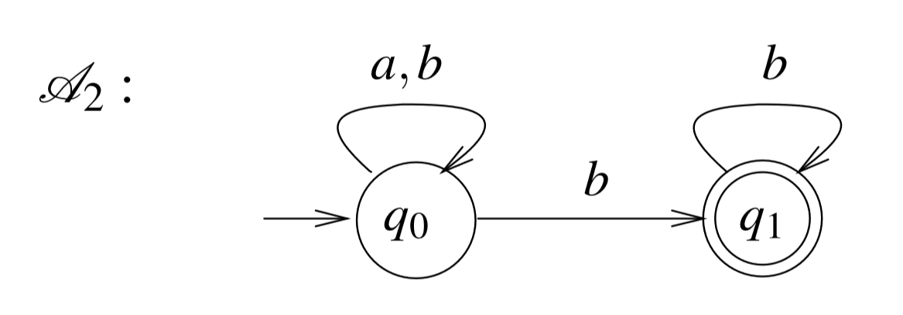

# Automata Theory and Model Checking

> 译文仓库：https://github.com/LauZyHou/Papers2Chinese
> 库内编号：2

## 关于原文和本文

论文 DOI：10.1007/978-3-319-10575-8_4

## 更多信息

译者(GitHub)：LauZyHou

主要工具：谷歌翻译

勘误者名单(GitHub)：

## 摘要

We study automata on infinite words and their applications in system specification and verification. We first introduce Büchi automata and survey their closure properties, expressive power, and determinization. We then introduce additional acceptance conditions and the model of alternating automata. We compare the different classes of automata in terms of expressive power and succinctness, and describe decision problems for them. Finally, we describe the automata-theoretic approach to system specification and verification.

我们研究了自动机在无限字以及在系统规约和验证中的应用。我们首先介绍了 Büchi 自动机，并考察了它们的闭包性质、表达力和确定性。紧接着引入了额外的可接受条件和交互的自动机模型。我们比较了不同类型的自动机在表达能力和简洁性方面的差异，并描述了它们的决策问题。最后，我们描述了系统规约和验证的自动机理论方法。

## 4.1 介绍

> Introduction

Finite automata on infinite objects were first introduced in the 1960s. Motivated by decision problems in mathematics and logic, Büchi, McNaughton, and Rabin developed a framework for reasoning about infinite words and infinite trees [6, 52, 61]. The framework has proved to be very powerful. Automata and their tight relation to second-order monadic logics were the key to the solution of several fundamental decision problems in mathematics and logic [62, 74].

无限对象上的有限自动机最初是在 20 世纪 60 年代引入的。在数学和逻辑决策问题的推动下，Büchi，McNaughton 和 Rabin 开发了一个推理无限单词和无限树的框架[6,52,61]。事实证明，该框架非常强大。自动机及其与一元二阶逻辑的紧密关系是解决几个数学和逻辑上的基本决策问题的关键[62,74]。

Today, automata on infinite objects are used for specification and verification of nonterminating systems. The idea is simple: when a system is defined with respect to a finite set AP of propositions, each of the system’s states can be associated with a set of propositions that hold in this state. Then, each of the system’s computations induces an infinite word over the alphabet 2AP, and the system itself induces a language of infinite words over this alphabet. This language can be defined by an automaton.
今天，无限对象上的自动机用于非终止系统的规约和验证。这个想法很简单：当一个系统是针对命题的有限集合 AP 定义的时，系统的每个状态都可以与一组在这种状态满足的命题相关联。然后，系统的每个执行都会在字母表 $2^{AP}$ 上产生一个无限字，系统本身引入了这个无限字上的语言。这种语言可以用自动机定义。

Similarly, a system specification, which describes all the allowed computations, can be viewed as a language of infinite words over 2AP, and can therefore be defined by an automaton. In the automata-theoretic approach to verification, we reduce questions about systems and their specifications to questions about automata. More specifically, questions such as satisfiability of specifications and correctness of systems with respect to their specifications are reduced to questions such as non-emptiness and language containment [48, 77, 79].

类似地，描述所有允许的执行的系统规约，可以被视为在 $2^{AP}$ 上的无限字语言，因此可以用自动机定义。在自动机理论的验证方法中，我们将有关系统及其性质规约的问题转化为关于自动机的问题。更具体地说，诸如可满足性规约和系统正确性规约之类的问题被转化为诸如"集合非空"和"语言包含"之类的问题[48,77,79]。

---

The automata-theoretic approach separates the logical and the combinatorial aspects of reasoning about systems. The translation of specifications to automata handles the logic and shifts all the combinatorial difficulties to automata-theoretic problems, yielding clean and asymptotically optimal algorithms, as well as better understanding of the complexity of the problems. Beyond leading to tight complexity bounds, automata have proven to be very helpful in practice.

自动机理论的方法将系统推理的逻辑和组合方面分开。 规约到自动机的转换处理了逻辑并将所有组合困难转移到自动机理论问题，产生清晰和渐近最优的算法，并能更好地理解问题的复杂性。 除了导致严格的复杂性限制之外，自动机已经在实践中被证实非常有用。

Automata are the key to techniques such as on-the-fly model checking [11, 21], and they are useful also for modular model checking [41], partial-order model checking [23, 31, 75, 78], model checking of real-time and hybrid systems [26], open systems [1], and infinite-state systems [40, 43]. Automata also serve as expressive specification formalisms [2, 39] and in algorithms for sanity checks [37]. Automata-based methods have been implemented in both academic and industrial automated-verification tools (e.g., COSPAN [24], SPIN [27], ForSpec [72], and NuSMV [9]).

自动机是诸如运行时模型检查等技术的关键[11,21]，它们也适用于模块化模型检查[41]，偏序模型检查[23,31,75,78]，实时和混合系统的模型检查[26]，开放系统[1]和无限状态系统[40,43]。 自动机也用于表达规约形式[2,39]以及用于健全性检查的算法[37]。 基于自动机的方法已经在学术和工业界的自动验证工具中实现（例如，COSPAN [24]，SPIN [27]，ForSpec [72]和 NuSMV [9]）。

This chapter studies automata on infinite words and their applications in system specification and verification. We first introduce Büchi automata, survey their closure properties, expressive power, and determinization. We then introduce additional acceptance conditions and the model of alternating automata. We compare the different classes of automata in terms of expressive power and succinctness, and describe decision problems for them. Finally, we describe the automata-theoretic approach to system specification and verification.

本章研究无限字上的自动机及其在系统规约和验证中的应用。 我们首先介绍 Büchi 自动机，研究它们的闭包特性，表达能力和确定性。 然后我们引入额外的可接受条件和交互的自动机的模型。 我们在表达能力和简洁性方面比较不同类别的自动机，并描述它们的决策问题。 最后，我们描述了系统规约和验证的自动机理论方法。

## 4.2 无限字上的非确定性 Büchi 自动机

> Nondeterministic Büchi Automata on Infinite Words

### 4.2.1 定义

> Definitions

For a finite alphabet Σ, an infinite word w = σ1 · σ2 · σ3 · · · is an infinite sequence of letters from Σ.We use Σω to denote the set of all infinite words over the alphabet Σ. A language L ⊆ Σω is a set of words. We sometimes refer also to finite words, and to languages L ⊆ Σ∗ of finite words over Σ. A prefix of w = σ1 ·σ2 · · · is a (possibly empty) finite word σ1 · σ2 · σ3 · · · σi, for some i ≥ 0. A suffix of w is an infinite word σi · σi+1 · · ·, for some i ≥ 1. A property of a system with a set AP of atomic propositions can be viewed as a language over the alphabet $2^{AP}$. We have seen in Chap. 2 that languages over this alphabet can be defined by linear temporal-logic (LTL, for short) formulas. Another way to define languages is by automata.

对一个有限的字母表$\Sigma$而言，无限字$w =\sigma_1 \cdot \sigma_2 \cdot \sigma_3··$是取自$\Sigma$的无限字母序列。我们使用$\Sigma^\omega$表示字母表$\Sigma$上的所有无限字的集合。 语言$L \subseteq \Sigma^\omega$是一组无限字。 我们有时也会提到有限字，以及$\Sigma$上有限字的语言$L \subseteq \Sigma^*$。对于$i \geqslant 0$，$w = \sigma_1 \cdot \sigma_2 \cdot ...$的前缀是（可能是空）有限字$\sigma_1 \cdot \sigma_2 \cdot \sigma_3 \cdot ... \cdot \sigma_i$。对于$i \geqslant 1$，$w$的后缀是无限字$\sigma_i \cdot \sigma_{i+1} \cdot ...$。原子命题集合 AP 上的系统的性质可以被视为字母表$2^{AP}$上的语言。 我们在 Chap 2 中看到过，该字母表中的语言可以用线性时态逻辑（简称 LTL）公式定义。 定义语言的另一种方法是使用自动机。

A nondeterministic finite automaton is a tuple A = Σ,Q,Q0, δ,α, where Σ is a finite non-empty alphabet, Q is a finite non-empty set of states, Q0 ⊆ Q is a non-empty set of initial states, δ :Q×Σ →2Q is a transition function, and α is an acceptance condition, to be defined below.

一个非确定性有限自动机可表示为元组$\mathcal{A} = \langle \Sigma, Q, Q_0, \delta, \alpha \rangle $，其中$\Sigma$是有限非空字母表，$Q$是有限非空状态集，$Q_0 \subseteq Q$是非空的初始状态集合，$\delta : Q \times \Sigma \to 2^Q$是转移函数，$\alpha$是可接受条件，将在后面定义。

Intuitively, when the automaton A runs on an input word over Σ, it starts in one of the initial states, and it proceeds along the word according to the transition function. Thus, δ(q,σ) is the set of states that A can move into when it is in state q and it reads the letter σ . Note that the automaton may be nondeterministic, since it may have several initial states and the transition function may specify several possible transitions for each state and letter. The automaton A is deterministic if |Q0| = 1 and |δ(q,σ)| = 1 for all states q ∈ Q and symbols σ ∈ Σ. Specifying deterministic automata, we sometimes describe the single initial state or destination state, rather than a singleton set.

直观地，当自动机$A$在取自$\Sigma$中的输入字上运行时，它从某个初始状态开始，并且沿着该字依据转移函数继续执行。 因此，$\delta (q,\sigma)$是$A$处于状态$q$时读到字母$\sigma$可以转移到的状态的集合。 注意，自动机可能是不确定的，因为它可能具有若干个初始状态，并且转移函数可以为每个状态和字母指定若干个可能的转移。 如果对所有状态$q \in Q$和符号$\sigma \in \Sigma$有$|Q_0|=1$并且$|\delta (q,\sigma)|=1$，则称自动机$A$是确定的。 指定确定性自动机，我们有时会描述单个初始状态或目标状态，而不是单元素集合。

Formally, a run r of A on a finite word w = σ1 · σ2 · · · σn ∈ Σ∗ is a sequence r = q0, q1, . . . , qn of n + 1 states in Q such that q0 ∈Q0, and for all 0 ≤ i < n we have qi+1 ∈ δ(qi,σi+1). Note that a nondeterministic automaton may have several runs on a given input word. In contrast, a deterministic automaton has exactly one run on a given input word. When the input word is infinite, thus w = σ1 · σ2 · σ3 · · · ∈ Σω, then a run of A on it is an infinite sequence of states r = q0, q1, q2, . . . such that q0 ∈ Q0, and for all i ≥ 0, we have qi+1 ∈ δ(qi,σi+1). For an infinite run r, let inf (r) = {q : qi = q for infinitely many i’s }. Thus, inf (r) is the set of states that r visits infinitely often.

形式上，$A$中的有限字$w = \sigma_1 \cdot \sigma_2 \cdot ... \cdot \sigma_n \in \Sigma^*$上的执行$r$是序列$r = q_0, q_1,...,q_n$，这取自$Q$中的$n+1$个状态，其中$q_0 \in Q_0$，并且对于所有$0 \leqslant i < n$，我们有$q_{i+1} \in \delta (q_i, \sigma_{i+1})$。 请注意，非确定性自动机可能在给定输入字上有多种执行。 相反，确定性自动机在给定输入字上只有一种执行。 当输入字是无穷的时，也即$w=\sigma_1 \cdot \sigma_2 \cdot \sigma_3 \cdot ... \in \Sigma^{\omega}$，在$A$上对应的运行是无穷的状态序列$r=q_0,q_1,q_2,...$，其中$q_0 \in Q_0$，并且对于所有$i \geqslant 0$，我们有$q_{i+1} \in \delta (q_i, \sigma_{i+1})$。 对于无穷的运行$r$，记$inf(r)=\{q:q_i=q \ for \ infinity \ many \ q's\}$。 即是说，$inf(r)$是$r$无限经常次访问的状态集的集合。

The acceptance condition α determines which runs are “good”. For automata on finite words, α ⊆ Q and a run r is accepting if qn ∈ α. For automata on infinite words, one can consider several acceptance conditions. Let us start with the Büchi acceptance condition [6]. There, α ⊆ Q, and a run r is accepting if it visits some state in α infinitely often. Formally, r is accepting iff inf (r) ∩ α = ∅. A run that is not accepting is rejecting. A word w is accepted by an automaton A if there is an accepting run of A on w. The language recognized by A , denoted L(A ), is the set of words that A accepts. We sometimes refer to L(A ) also as the language of A .

可接受条件$\alpha$确定哪些运行是“好”的。 对于有限字上的自动机，如果$q_n \in \alpha$，则$\alpha \subseteq Q$和$run \ r$将被接受。 对于无限字上的自动机，可以考虑若干可接受条件。 让我们从 Büchi 可接受条件[6]开始。 在那里，$\alpha \subseteq Q$，一个运行$r$是可接受的，仅当它能无限经常次地访问$\alpha$中的某个状态。 形式上，$r$是可接受的，当且仅当$inf(r) \cap \alpha \neq \phi$。 一个运行如果不是可接受的，那就是拒绝。 一个字$w$被一个自动机$A$接受，仅当存在$A$的识别$w$的可接受运行。 $A$所识别的语言，表示为$\mathcal{L(A)}$，是$A$接受的字的集合。 我们有时也将$\mathcal{L(A)}$称为 A 的语言。

We use NBW and DBW to abbreviate nondeterministic and deterministic Büchi automata, respectively.1 For a class γ of automata (so far, we have introduced γ ∈ {NBW,DBW}), we say that a language L ⊆ Σω is γ -recognizable iff there is an automaton in the class γ that recognizes L. A language is ω-regular iff it is NBWrecognizable.

我们使用 NBW 和 DBW 分别作为非确定性和确定性的 Büchi 自动机的缩写。对于自动机的类别$\gamma$（到目前为止，我们已经引入了$\gamma \in \{NBW,DBW\}$）。称$L \subseteq \Sigma^{\omega}$是$\gamma$-可识别的，当且仅当在类$\gamma$中存在识别语言$L$的自动机。称一个语言是$ω$-正则的，当且仅当它是 NBW-可识别的。

Example 1 Consider the DBW A1 appearing in Fig. 1. When we draw automata, states are denoted by circles. Directed edges between states are labeled with letters and describe the transitions. Initial states (q0, in the figure) have an edge entering them with no source, and accepting states (q1, in the figure) are identified by double circles. The DBW moves to the accepting state whenever it reads the letter a, and it moves to the non-accepting state whenever it reads the letter b. Accordingly, the singlerun r onawordw visits the accepting state infinitely often iff w has infinitely many a’s. Hence, L (A1)={w:w has infinitely many a’s}.

**例1。** 考察图1中出现的DBW $A_1$。当我们绘制自动机时，状态用圆圈表示。状态之间的有向边用字母标记以描述转移。初始状态(图中为$q_0$)有一条不带源点的边，可接受状态(图中为$q_1$)由双圆圈标识。当DBW读到字母a时，就会转移到可接受状态，当它读到字母b时，就会移动到不可接受状态。因此，$\mathcal{L(A_1)}=\{w:w \ has \ infinity \ many \ a's\}$。

图1：DBW$\{w:w \ has \ infinity \ many \ a's\}$

Example 2 Consider the NBW A2 appearing in Fig. 2. The automaton is nondeterministic, and in order for a run to be accepting it has to eventually move to the accepting state, where it has to stay forever while reading b. Note that if A2 reads a from the accepting state it gets stuck. Accordingly, A2 has an accepting run on a wordw iff w has a position from which an infinite tail of b’s starts. Hence, L (A2)={w:w has only finitely many a’s}.

**例2。** 考虑图2中出现的NBW $A_2$。这个自动机是非确定性的，为了让运行是可接受的，它最终必须转移到可接受状态，在读取b时它必须永远停留在那里。注意，如果$A_2$从接受状态读取a，它就会被卡住。因此，A2在字w上有一个可接受的运行，当且仅当w从某一位置开始有无限长的b组成的的尾部。因此，$\mathcal{L(A2)}=\{w:w \ has \ only \ finity \ many \ a's\}$。

图2：DBW$\{w:w \ has \ only \ finity \ many \ a's\}$

Consider a directed graph G=V,E.Astrongly connected set of G (SCS) is aset C⊆V of vertices such that for every two vertices v,v∈C, there is a path fromv to v. An SCSC is maximal if it cannot be extended to a larger SCS. Formally, for every nonempty C⊆V \C, we have that C∪C is not an SCS. The maximal strongly connected sets are also termed strongly connected components (SCC). An automaton A =Σ,Q,Q0,δ,αinduces a directed graph GA =Q,Ein which q,q∈E iffthereisaletter σ suchthat q∈δ(q,σ).When we talk about the SCSs and SCCs of A , we refer to those of GA . Consider a run r of an automaton A . It is not hard to see that the set inf(r) is an SCS. Indeed, since every two states q and q in inf(r) are visited infinitely often, the state q must be reachable from q.

考虑一个有向图$G=\langle V,E \rangle$。$G$的强连通集(SCS)是顶点集$C\subseteq V$，对于其中每两个顶点$v,v \in C$，都有一条从$v$到$v'$的路径。 如果不能将某个$SCS$扩展到更大的SCS，则称它是最大强连通集。 形式上，对于每个非空集合$C \in V \setminus C$，都有$C \cup C'$都不再是SCS。 最大强连接集也称为强连通分量(SCC)。 一个自动机$A=\langle\Sigma,Q,Q_0,\delta,\alpha\rangle$对应着一个有向图$G_A=Q,E$，其中$\langle q,q' \rangle \in E$仅当存在字母$\sigma$，使得$q \in \delta(q',\sigma)$。 当我们谈论$A$的SCS和SCC时，我们指的就是有向图$G_A$。 考虑自动机$A$的运行$r$。 不难看出集合$inf(r)$是一个SCS。 实际上，由于$inf(r)$中的任意两个状态$q$和$q'$都可以被无限经常次访问，因此状态$q'$一定可以从$q$到达。

### 4.2.2 封闭性

> Closure Properties

Automata on finite words are closed under union, intersection, and complementation. In this section we study closure properties for nondeterministic Büchi automata.

有限字上的自动机对并、交、补运算是封闭的。 在本节中，我们学习非确定性Büchi自动机中的封闭性。

#### 4.2.2.1 并和交下的封闭性

>  Closure Under Union and Intersection

We start with closure under union, where the construction that works for nondeterministic automata on finite words, namely putting the two automata “one next to the other”, works also for nondeterministic Büchi automata. Formally, we have the following.

我们从并运算之下的封闭性开始，在这种情况下，对有限字进行非确定性自动机的构造（即将两个自动机“一个接着另一个”）也适用于非确定性Büchi自动机。 形式上，有如下陈述。

Theorem 1 ([8]) Let A1 and A2 be NBWs with n1 and n2 states, respectively. There is an NBW A such that L (A ) =L (A1)∪L (A2) and A has n1 +n2 states.

**定理1** 令$A_1$和$A_2$分别是有$n_1$和$n_2$个状态的NBW。 存在一个NBW $A$，使得$\mathcal{L(A)} = \mathcal{L(A1)} \cup \mathcal{L(A2)}$且$A$具有$n_1+n_2$个状态。

Proof Let A1 =Σ,Q1,Q0 1,δ1,α1 and A2 =Σ,Q2,Q0 2,δ2,α2. We assume,without loss of generality, that Q1 and Q2 are disjoint. Since nondeterministic automata may have several initial states, we can define A as the NBW obtained by taking the union of A1 and A2. Thus, A =Σ,Q1∪Q2,Q0 1∪Q0 2,δ,α1∪α2,where for every state q ∈Q1 ∪Q2, we have thatδ(q,σ)=δi(q,σ), for the indexi ∈{1,2}suchthat q ∈Qi.It is easy to see that for every word w∈Σω,the NBW A has an accepting run on w iff at least one of the NBWs A1 and A2 has an accepting run on w.

证明，设$A_1=\langle\Sigma,Q_1,Q_{01},\delta_1,\alpha_1\rangle$以及$A_2=\langle\Sigma,Q_2,Q_{02},\delta_2,\alpha_2\rangle$。 在不失一般性的前提下，我们假设$Q_1$和$Q_2$是不交的。 由于非确定性自动机可以具有若干个初始状态，因此我们可以将$A$定义为通过将$A_1$和$A_2$做并运算得到的NBW。 因此，$A=\langle \Sigma,Q_1 \cup Q_2,Q_{01} \cup Q_{02},\delta,\alpha_1\cup\alpha_2 \rangle$，其中对于每个状态$q \in Q_1 \cup Q_2$，我们有$\delta(q,\sigma)=\delta_i(q,\sigma)$，索引$i\in\{1,2\}$使得$q\in Q_i$。很容易看到，对于每个字$w \in \Sigma^\omega$，NBW $A$在$w$上有一个可接受的运行，当且仅当NBW $A_1$和$A_2$中至少有一个在$w$上有一个可接受的运行。

We proceed to closure under intersection. For the case of finite words, one proves closure under intersection by constructing, given A1 and A2, a “productautomaton” that has Q1×Q2 as its state space and simulates the runs of both A1 and A2 on the input words. A word is then accepted by both A1 and A2 iff the product automaton has a run that leads to a state in α1×α2. As the example below demonstrates, this construction does not work for Büchi automata.

接下来我们看看在交运算下的封闭性。对于有限字下的自动机，可以这样来证明交运算的封闭性，给定$A_1$和$A_2$的情况下构造一个以$Q1×Q2$作为其状态空间的“乘积自动机”，并在输入字上模拟$A_1$和$A_2$的运行，来证明交运算下的封闭性。 $A_1$和$A_2$都接受一个字当且仅当乘积自动机运行到$\alpha_1 \times \alpha_2$的状态。 如下例所示，此构造不适用于Büchi自动机。

